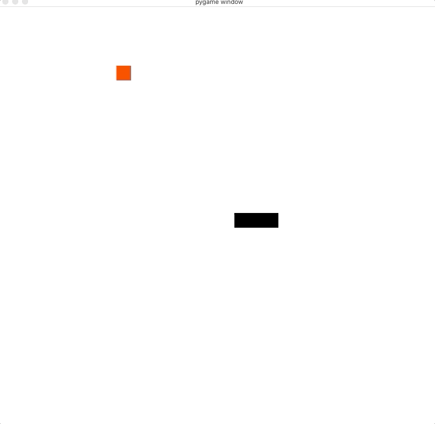

# Le TP du "Snake"

Le but de ce TP est de réaliser ensemble un petit jeu vidéo, en utilisant Python, les outils de Visual Studio Code et la librairie `pygame` que vous allez découvrir.

## Préambule

Créons un environnement conda:

```bash
(base) $ conda create -n snake python=3.10

(base) $ conda activate snake

(snake) $ pip install -r requirements.txt
```

_Comprenez-vous ce qui s'est passé avec cette commande ? pouvez-vous l'expliquer ?_

## Lancement du programme

Lancez le programme initial disponible dans `code.py`, _que se passe-t-il ?_

Lancez ce même programme dans le debugger de Visual Studio Code, arrivez-vous à mettre un point d'arrêt ?

## Ajout du code d'arrêt

On souhaite réagir aux touches du clavier, en interprétant les événements que le jeu reçoit.

_Chechez sur internet une façon de détecter qu'on souhaite "fermer" la fenêtre._

De même, _cherchez une façon d'interpréter les événements du clavier_

## Le damier

on souhaite désormais à dessiner un damier à l'écran, sous la forme:


pour cela, vous pouvez utiliser la méthode
[`pg.draw.rect()`](https://www.pygame.org/docs/ref/draw.html#pygame.draw.rect)
qui dessine un rectangle:

```python
rect = pg.Rect(x, y, width, height)
color = (255, 0, 0) # rouge
pg.draw.rect(screen, color, rect)
```

## Dessin du serpent

On souhaite désormais dessiner un serpent, aux coordonnées suivantes:

```python
snake = [
    (10, 15),
    (11, 15),
    (12, 15),
]
```

sous la forme:


## Le serpent qui bouge

Ajoutez un code permettant de faire bouger le serpent en cliquant sur les touches:


on veut utiliser les touches directionnelles.

## Le fruit

On ajoute désormais le fruit, à une position aléatoire.



Ajouter le code pour:
- insérer le fruit à une position aléatoire, vide (on consultera la documentation du [module `random`](https://docs.python.org/3/library/random.html))
- détecter que le serpent "mange" le fruit en passant dessus

## Le score

Ajouter le code permettant de compter le score, et de l'afficher en haut de la fenêtre (chercher `pygame.display.set_caption`).